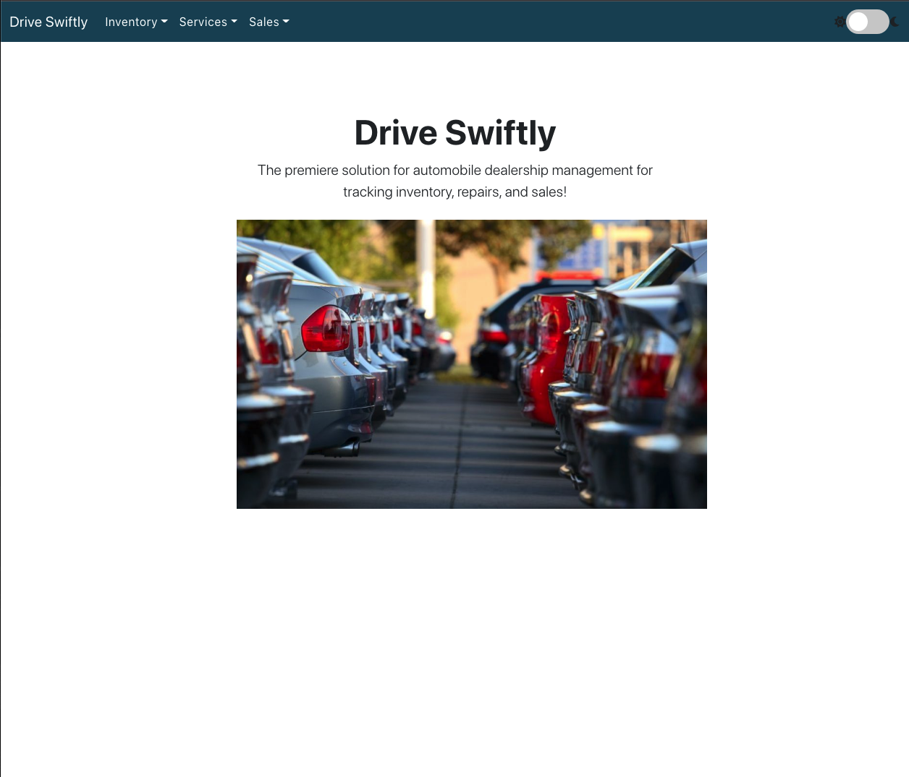
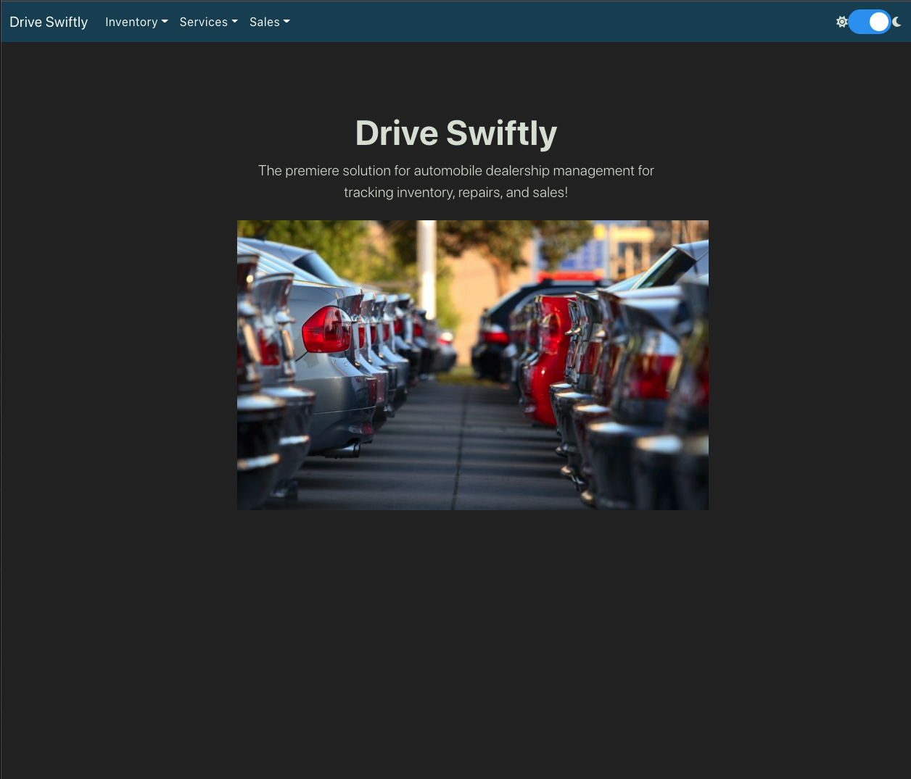
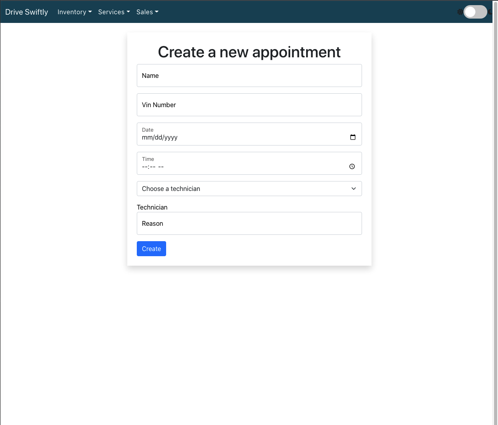
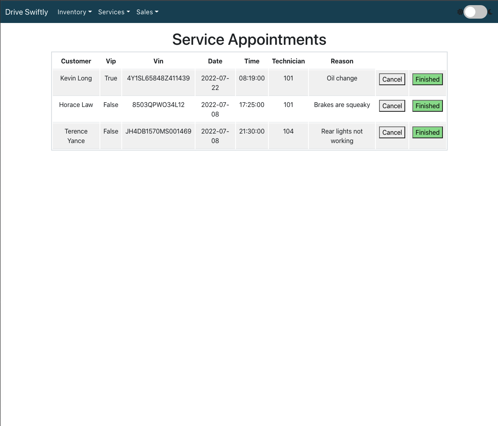
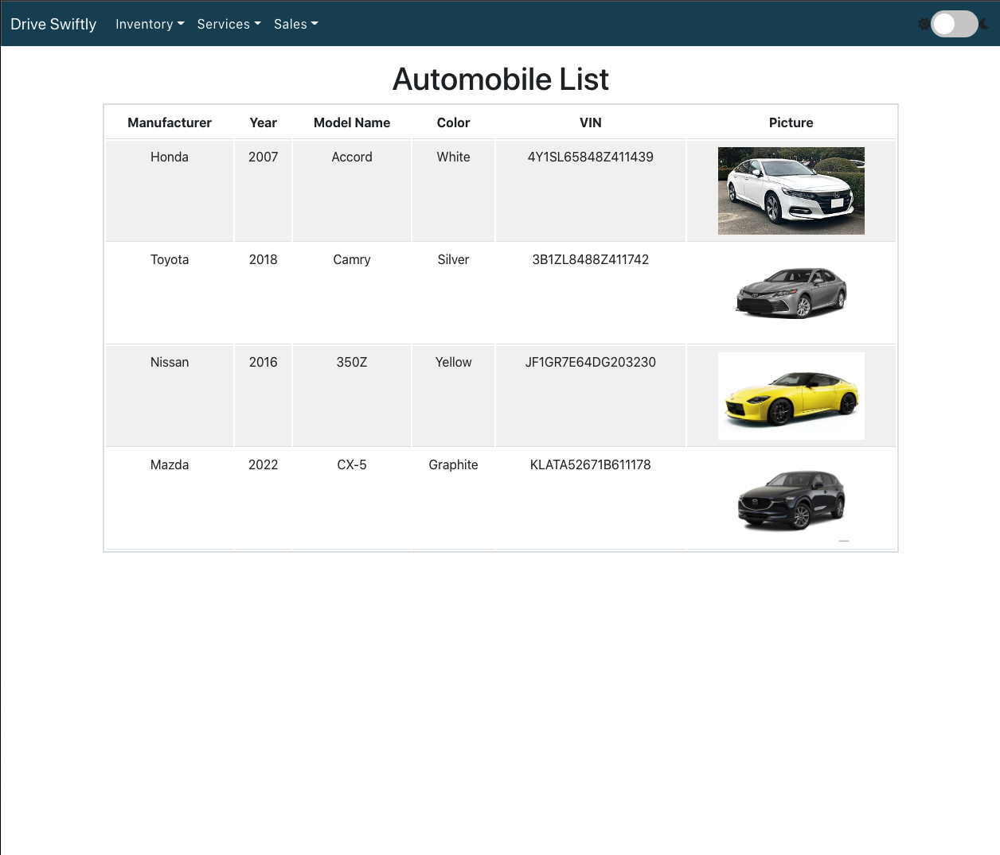
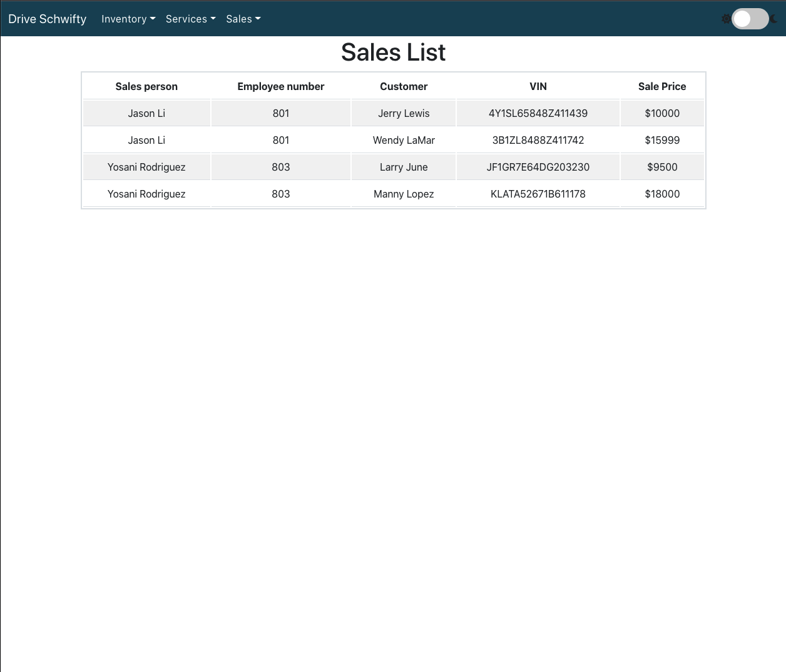
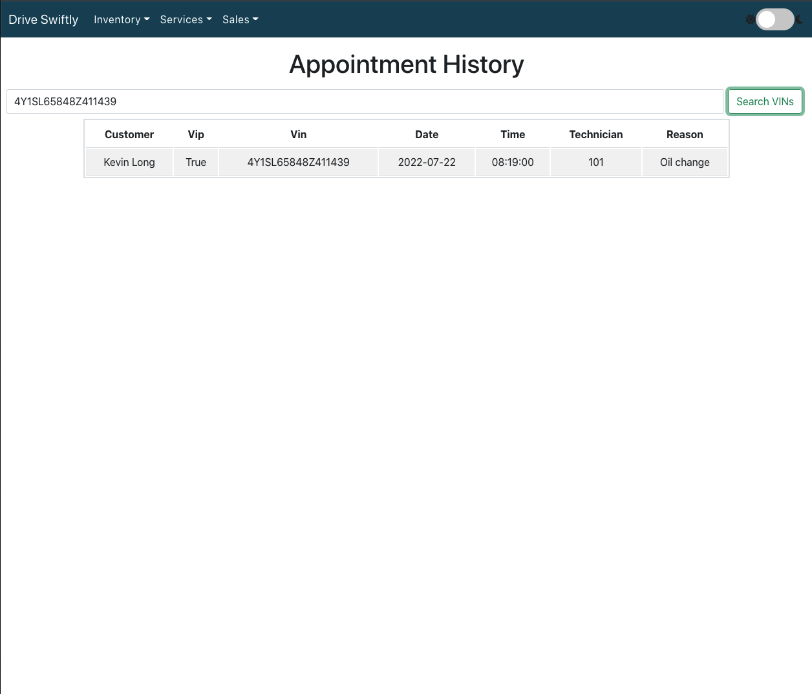
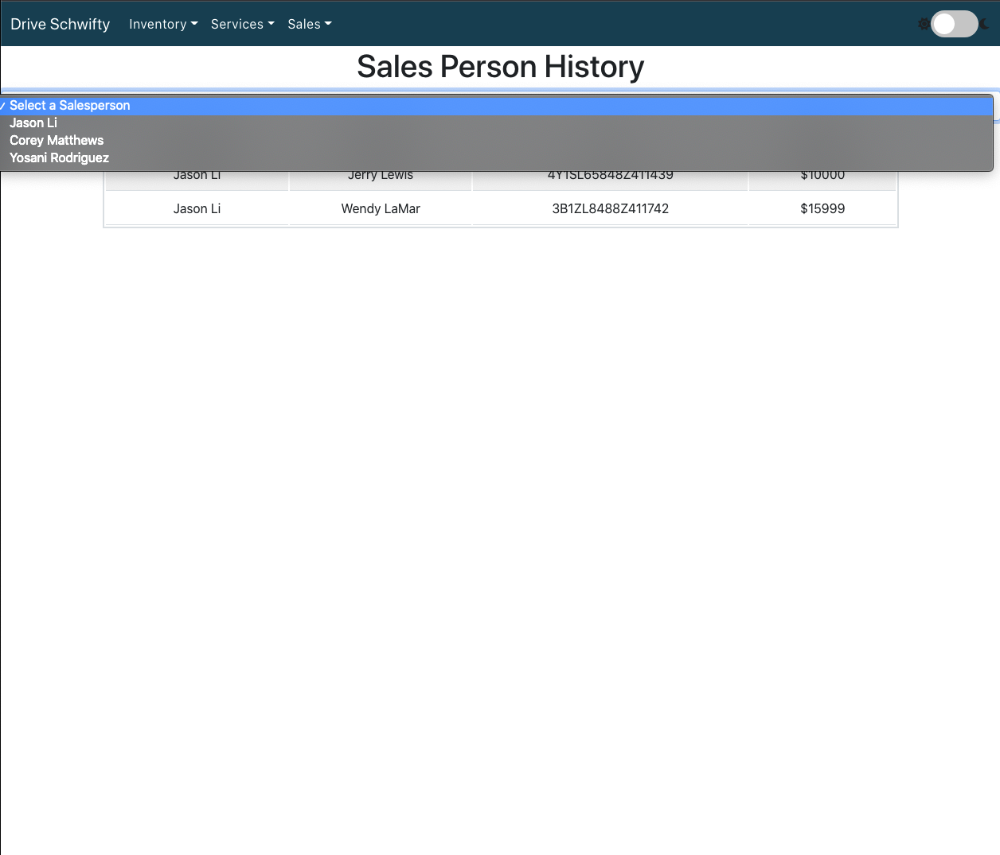

# Drive Swiftly Dealership Management

## Technologies Used

- Setup and Configuration: \
  
  
  

- Front End Development : \
  
  

- Back End Development: \
  
  
  

## Setup

Install Docker

In your terminal, create docker volume: \
`docker volume create beta-data`

Docker compose build and then up: \
`docker compose build` \
`docker compose up`

Access in browser:\
`http://localhost:3000`

---

### Entire Site

- Dark Mode/Light Mode toggle
- Stretch goal: authentication/JWT

### Services

- List of technicians with the ability to delete them
- If a technician is deleted, you should be able to reassign a technician to their appointments

### Sales

- Display and create sales history amongst salespersons and what cars are sold to customers
- Check to see if the vehicle was already sold when selling a vehicle

### Inventory

Team:

- Person 1 - Chad - Services
- Person 2 - Jason - Sales

## Design

When a user opens the site, from the homepage, they should have dropdowns to each category of stuff that they have access to; services, sales, and inventory.

Off of the services dropdown, they should be able to:

- Create a Technician
- Show Appointments
- Create an Appointment
- Show Appointment History

Off of the sales dropdown, they should be able to:

- Create a New Salesperson
- Create a New Customer
- Create a New Sales Record
- Show a Sales List
- Get the Sales History of a Salesperson

Off of the inventory dropdown, they should be able to:

- Show Manufacturers
- Create Manufacturers
- Show Vehicle Models
- Create Vehicle Models
- Show Automobiles
- Create Automobiles
  

## Service microservice

The Service functionality needs to keep track of service appointments for automobiles and their owners, along with being able to create technicians to then assign to an appointment.

So the models I will be making are a technician model and an appointment model. I will also be making an AutomobilieVO model that will be storing the data that I need from the Automobile model from the Inventory microservice.

In order to grab that data, I will be using polling, to poll the Inventory database for the data I need and assigning it to the AutomobileVO model fields.

## Sales microservice

The sales microservice records a salesperson's automobile sales, tracking the movement of what is in the vehicle inventory. The models required will be a Salesperson, Customer, and a Sales record. The Sales record model will poll for for data in the microservice to pull data from the main inventory application.

## App Overview

 
    <h3 align="center">Homepage & Dark mode option</h3>
  
     
    <h3 align="center">Example form submission; appointment lists</h3>
    
      
    <h3 align="center">Car lists and populated sales</h3>
    
     
    <h3 align="center">VIN Search and Salesperson record history filtering</h3>
    
     

  

